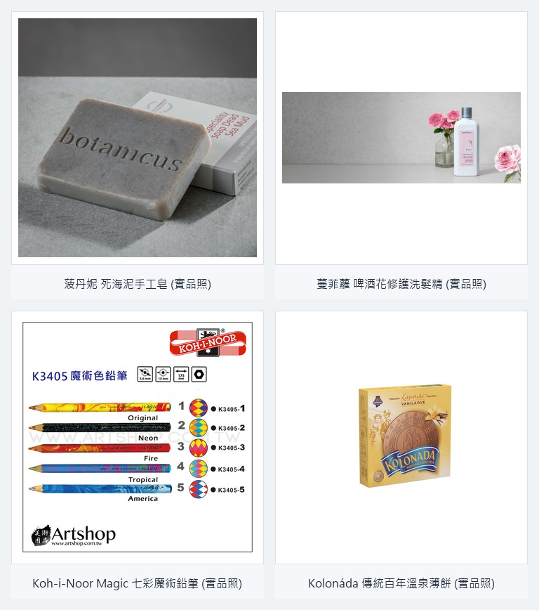
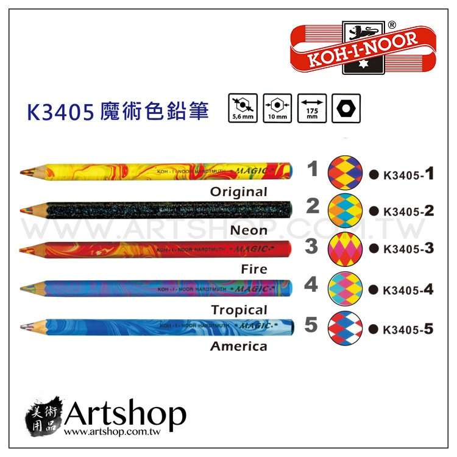
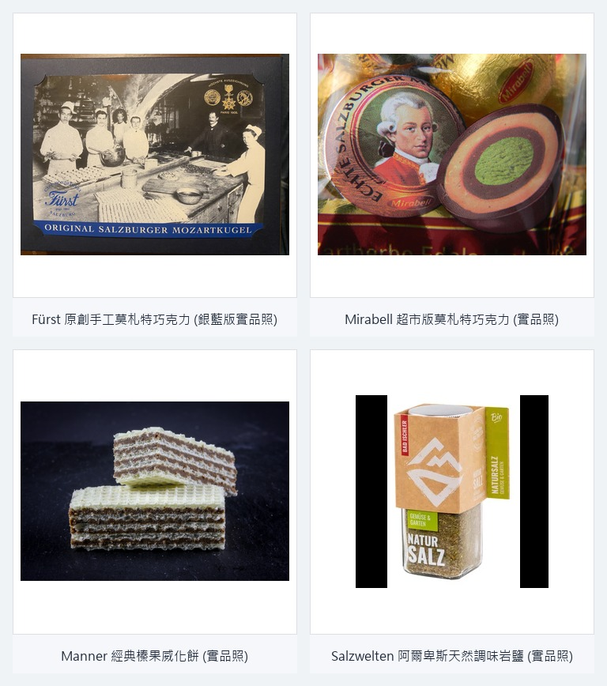
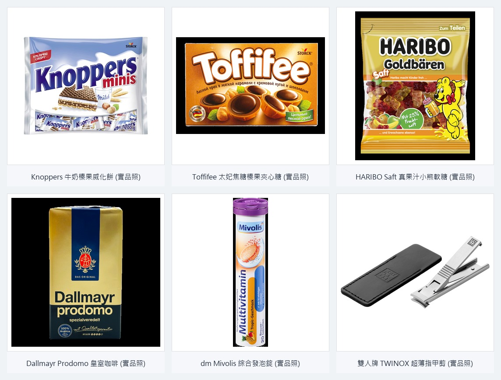
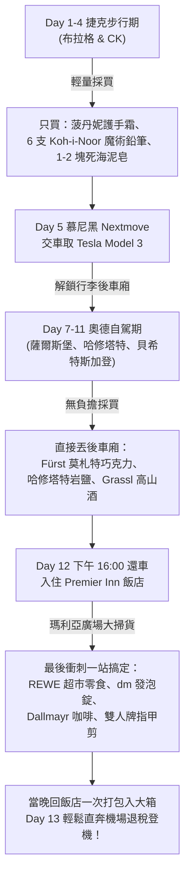

# 🎁 歐洲 13 日純電自駕 — 伴手禮完全採買指南
## （捷克 🇨🇿 ➔ 奧地利 🇦🇹 ➔ 德國 🇩🇪）

> **三大採買核心原則**：
> 1. **辦公室分食友善**：優先選擇獨立小包裝、耐放、不易融化的點心。
> 2. **價差驚人有誠意**：挑選台灣專櫃 3～4 折的在地護膚品，或歐洲獨有的百年工藝品牌。
> 3. **行李輕量自駕流**：前期大巴搭乘不負重，自駕期放後車廂，笨重零食藥妝統一於最後一天慕尼黑市區一網打盡！

---

## 🇨🇿 第一章：捷克段（布拉格 Day 1–3 ｜ 庫倫洛夫 CK Day 4）

捷克物價在歐洲極具競爭力，以**天然有機草本香氛**、**波希米亞文具**與**傳統宮廷點心**聞名。此時為旅程初期（搭乘大眾運輸與跨國大巴），**切記買精不買多**，以體積小、重量輕為首選。

### 🌟 捷克四大精華伴手禮詳解

#### 1. 菠丹妮 (Botanicus) — 死海泥手工皂 & 玫瑰修護護手霜
*   **特色與優勢**：台灣專櫃一塊死海泥肥皂售價高達 NT$ 600～700，在布拉格總店僅約 130～150 CZK（約 NT$ 180～200），價差高達 3 折！深層去油控痘，洗後清爽不乾澀。大馬士革玫瑰護手霜 (50g) 質地細緻、純天然芳香，是體積最輕的專櫃級贈禮。
*   **哪裡買**：布拉格老城區提恩教堂後方總店 (`Týnský dvůr 3, Prague`)。店內配備中文服務人員與退稅單櫃檯。
*   **建議購買量**：死海泥皂 2～3 塊（送核心戰友），玫瑰護手霜 3～5 條（輕巧送女同事）。

#### 2. 蔓菲蘿 (Manufaktura) — 啤酒花修護洗髮精 & 護唇膏
*   **特色與優勢**：捷克為世界人均啤酒消費量第一大國，其啤酒花保養品（Pivní kosmetika）富含維生素 B 群與麥芽精華。這款洗髮精完全無酒臭味，洗後蓬鬆柔順，帶有非常清新的果香；潤唇膏則手繪感十足，價格約 100 CZK 出頭，親民又有異國特色。
*   **哪裡買**：布拉格老城區、瓦茨拉夫廣場、布拉格城堡區或 CK 小鎮均有連鎖門市。
*   **建議購買量**：洗髮精 1～2 瓶（自用或摯友），護唇膏 5～8 支（分發同事零負擔）。

#### 3. 酷喜樂 (Koh-i-Noor Hardtmuth) — Magic 七彩魔術鉛筆 (Jumbo) & 專用削筆機

*   **特色與優勢**：捷克 200 多年國寶級文具。這不是一整盒普通單色色鉛筆，而是**單支鉛筆的筆芯本身就由三種以上不同顏色複合絞合而成（如上圖）**！書寫時隨著手腕轉動角度不同，畫出的筆觸會自然呈現無縫漸層的夢幻彩虹色彩。
*   **重要提醒**：請挑選型號為 **「粗三角桿 (Magic Jumbo)」**（筆身直徑約 10mm），專門設計給學齡兒童，握筆最省力且筆芯極耐摔耐壓。**務必順便在櫃檯加購 1～2 個「Koh-i-Noor 大孔專用削鉛筆機」**（如圖中紅色雙孔削筆器，大孔專削 Jumbo 粗桿），台灣普通削筆機孔徑通常塞不下。
*   **哪裡買**：**CK 小鎮門市最推薦**（舊城區 `Kostelní 166, Český Krumlov`，門口有著名木雕刺蝟筆座）。
*   **建議購買量**：**買 6 支**（送親戚同事的小孩）＋ 2 個專用削筆器。

#### 4. Kolonáda — 百年溫泉夾心薄餅 (Oplatky)
*   **特色與優勢**：捷克自 1856 年傳承至今的貴族下午茶點心。薄酥脆的餅皮夾著榛果可可或肉桂香草餡，外觀像超大圓形法蘭酥。
*   **哪裡買**：布拉格或 CK 市區各大超市（Billa、Albert）均有整排貨架，一盒僅約 45～60 CZK（約 NT$ 65～85）。
*   **建議購買量**：買 2～3 盒直接整盒貢獻給辦公室茶水間，同事下午配黑咖啡無敵解饞。

---

### 📋 捷克採買快查清單

| 品項名稱 | 當地原文標示 | 建議採買地點 | 參考單價 (CZK) | 適合贈送對象 | 打包注意 |
|---------|-------------|-------------|---------------|-------------|---------|
| **死海泥手工皂** | Botanicus Dead Sea Mud Soap | 布拉格提恩教堂總店 | 130～150 CZK | 部門主管、代理戰友 | 皂體密度大較重，勿超量 |
| **純天然玫瑰護手霜** | Botanicus Rose Hand Cream | 布拉格提恩教堂總店 | 210～260 CZK | 女性同事、閨蜜 | 鋁管防擠壓，放衣服夾層 |
| **啤酒花洗髮精/潤唇膏**| Manufaktura Pivní šampon / Balzám | 蔓菲蘿各連鎖門市 | 109～249 CZK | 注重生活質感同事 | 洗髮精瓶口膠帶封好托運 |
| **Magic 七彩魔術鉛筆** | Koh-i-Noor Magic Jumbo | CK 小鎮門市 | 35～55 CZK/支 | 家中有小孩的同事 | **記得加購專用大削筆器** |
| **百年溫泉薄餅** | Kolonáda Tradiční Oplatky | 各大連鎖超市 (Albert/Billa) | 45～60 CZK | 整個部門公家茶水間 | 餅盒薄脆，夾在軟衣物間 |

---

## 🇦🇹 第二章：奧地利段（薩爾斯堡 Day 7 ｜ 哈修塔特・上特勞恩 Day 8）

奧地利段已駕駛 **Tesla Model 3**，所有採購品可隨時置入車廂後行李箱與前行李箱（Frunk），負重問題完全解決！此區以**世界文化遺產手工甜點**與**阿爾卑斯純淨高山岩鹽護理**著稱。

### 🌟 奧地利精華伴手禮詳解

#### 1. 莫札特巧克力 (Mozartkugeln) — 原創手工版 vs 超市分享版
*   **內行尊爵首選：Cafe Konditorei Fürst（銀藍色包裝）**
    *   **獨特性**：1890 年由薩爾斯堡糕點大師 Paul Fürst 發明，純手工製作，中間為香濃綠色開心果杏仁膏，外裹濃郁黑巧克力。**全世界上僅在薩爾斯堡老城 4 家直營店販售**！不含防腐劑，保質期約 4～8 週，口感細緻不死甜。
    *   **哪裡買**：薩爾斯堡老城舊市集廣場 (`Alter Markt 3, Salzburg`)。
    *   **送禮對象**：送重要長輩、長官或摯友（買 5 顆或 10 顆禮盒裝）。
*   **大眾海量首選：Mirabell（紅金六角盒/袋裝）**
    *   **特色**：奧地利超市銷量冠軍，圓形或六角盒包裝，內含幾十顆獨立包裝球形巧克力，性價比極高。
    *   **哪裡買**：薩爾斯堡中央車站旁 SPAR 超市。

#### 2. Manner — 奧地利國寶威化餅 (Manner Minis)
*   **特色與優勢**：維也納百年標誌性粉紅包裝點心，香濃榛果可可醬（Neapolitaner）夾層，薄脆誘人。
*   **內行挑選指南**：
    *   超市購買 **「Manner Minis」** 大袋裝，裡面有 10～20 條獨立隨身小包，最適合每位同事各發一條。
    *   除了經典榛果，奧地利獨家限定的 **「檸檬口味 (Zitrone)」** 帶著微酸果香，在台灣非常罕見且廣受好評！
*   **哪裡買**：薩爾斯堡老城大教堂旁專賣店，或各大 SPAR / BILLA 超市。

#### 3. 哈爾施塔特 — 天然岩鹽保濕護手霜 & 研磨調味岩鹽
*   **特色與優勢**：哈修塔特坐擁世界最古老 7,000 年鹽礦。利用山泉沉澱高濃度微量礦物製成的「天然岩鹽護手霜 (Natursalz Handcreme)」，深層滋潤且秒速吸收，無油膩感。另有搭配阿爾卑斯香草、蒜香或黑松露的研磨岩鹽罐，廚房烹飪儀式感拉滿。
*   **哪裡買**：哈修塔特湖畔鹽礦工坊 (`Salzkontor`) 或達赫斯坦纜車站周邊特色小店。

#### 4. Styx (詩蒂克) / Ovis — 阿爾卑斯雪絨花與山羊奶護手霜
*   **特色與優勢**：奧地利天然有機認證保養品，採用阿爾卑斯山珍稀雪絨花 (Edelweiss) 精華與奧地利新鮮羊奶，專為抵抗阿爾卑斯高山乾冷氣候研發，對抗秋冬換季乾癢與洗手龜裂特別有效。
*   **哪裡買**：薩爾斯堡市區 BIPA / Müller 藥妝店或傳統藥局 (Apotheke)。

---

### 📋 奧地利採買快查清單

| 品項名稱 | 當地原文標示 | 建議採買地點 | 參考單價 (EUR) | 適合贈送對象 | 打包注意 |
|---------|-------------|-------------|---------------|-------------|---------|
| **原創銀藍莫札特巧克力** | Original Salzburger Mozartkugeln (Fürst) | 薩爾斯堡 Fürst 老城總店 | €1.8～€2.2/顆 | 核心長官、特別好友 | 純手工無防腐劑，避免日曬暖氣 |
| **超市版莫札特巧克力** | Mirabell Mozartkugeln (袋裝) | 薩爾斯堡車站 SPAR 超市 | €4.5～€6.5/包 | 辦公室同事隨機分食 | 常溫保存即可 |
| **Manner 威化餅分享包** | Manner Minis Neapolitaner / Zitrone | 各大 SPAR / BILLA 超市 | €2.5～€3.5/袋 | 茶水間公用零食區 | 獨立小包好拆分 |
| **天然岩鹽保濕護手霜** | Hallstatt Natursalz Handcreme | 哈修塔特 Salzkontor 專賣店 | €6.0～€9.0/條 | 常洗手乾裂的辦公室同事 | 鋁管或軟管，放 Tesla 後車廂 |
| **阿爾卑斯香草研磨岩鹽** | Hallstätter Bergkern Salz (Mühle) | 哈修塔特老街 / 達赫斯坦 | €5.5～€8.0/罐 | 喜愛露營、烹飪的美食同事 | 玻璃研磨罐，用紙巾或衣服包裹 |
| **雪絨花/羊奶有機護手霜** | Styx / Ovis Edelweiss Handcreme | 薩爾斯堡 BIPA / 藥局 | €5.0～€8.0/條 | 女性長輩、注重護膚朋友 | 滋潤度高，秋冬必備 |

---

## 🇩🇪 第三章：德國段（慕尼黑 Day 5 & 12 ｜ 富森 Day 6 ｜ 貝希特斯加登 Day 9–11）

德國是伴手禮的大本營！具備**最高 CP 值的藥妝保健**、**世界馳名的威化點心**、**巴伐利亞皇室御用咖啡**與**百年鋼鐵精工**。全部採買集中在 **Day 12 下午（還車入住 Premier Inn 後於瑪利亞廣場徒步區）**，最省力、最從容。

### 🌟 德國四大領域伴手禮詳解

#### 1. 德國超市零食四大天王（辦公室茶水間秒殺）
*   **Knoppers 牛奶榛果威化餅**：德國銷量冠軍！五層酥脆結構，一口咬下有可可、威化與牛奶三重享受。買 10 入家庭分享包，價格僅約 €2.0～€2.5。
*   **Toffifee 太妃焦糖榛果夾心球**：底層太妃焦糖、中層完整榛果粒與牛軋糖、頂部黑巧克力。一盒 24 顆不到 €1.5，香濃酥脆。
*   **HARIBO 德國限定真果汁小熊軟糖 (Saft Goldbären)**：請認明金袋下方有「**MIT FRUCHTSAFT! (含 22% 真正天然果汁)**」字樣。口感比普通版 Q 彈多汁，完全不生硬。
*   **Elisenlebkuchen 德式頂級堅果薑餅**：不含小麥粉，以滿滿核桃、杏仁和蜂蜜烤製，秋天搭配黑咖啡的無上享受。

#### 2. dm 藥妝神物（銅板價百元有找）
*   **Mivolis 綜合維他命發泡錠**：每條僅約 **€0.55～€0.85（約 NT$ 20～30！）**。維他命 C（紅/橘蓋）、鎂（綠蓋）、多種維生素（紫蓋），是送全公司同事每人一條的無敵首選。
*   **Kamill 洋甘菊護手霜 & Balea 精華時空膠囊**：滋潤小巧，一顆膠囊就能潤澤整張臉，女生同事爭相收藏。

#### 3. 慕尼黑皇室御用：Dallmayr 精品咖啡與高山草本茶
*   **Dallmayr Prodomo 咖啡豆/粉**：巴伐利亞皇室御用品牌，特殊烘焙去除酸澀刺激，香醇溫潤。復古黑金燙金鐵罐包裝（約 €8～€10），擺在主管辦公桌上體面大器。
*   **Bad Heilbrunner 草本調理茶包**：德國超市常駐草本茶，晚安舒眠茶 (Schlaf-Tee) 與喉嚨舒緩茶，獨立濾袋設計，一盒才 €1 左右。

#### 4. 貝希特斯加登限定草本酒 & 德國百年精工刀具
*   **Grassl 龍膽草高山烈酒 (Berchtesgadener Enzian)**：德國最古老酒廠（1692 年創立），使用國王湖山區龍膽草根釀造，飯後一杯助消化，瓶身極具巴伐利亞高山木刻風格。
*   **雙人牌 (Zwilling) 超薄隨身指甲剪**：德國鋼鐵極致工藝，厚度僅 3mm，折疊收合完全平整，刀口極為銳利，耐用數十年，送禮不失禮的實用天花板。

---

### 📋 德國採買快查清單

| 品項名稱 | 當地原文標示 | 建議採買地點 | 參考單價 (EUR) | 適合贈送對象 | 打包注意 |
|---------|-------------|-------------|---------------|-------------|---------|
| **Knoppers 榛果威化餅** | Knoppers 10 Pack / Minis | 慕尼黑 REWE / Edeka 超市 | €1.99～€2.49 | 辦公室下午茶共享 | 外層薄脆，注意防壓 |
| **Toffifee 太妃夾心糖** | Storck Toffifee 24er | 慕尼黑各大超市 | €1.39～€1.69 | 甜食愛好者、全組同事 | 常溫保存，避開暖氣直吹 |
| **HARIBO 真果汁小熊** | HARIBO Goldbären Saft | 慕尼黑各大超市 | €1.19～€1.49 | 年輕同事、家中兒童 | 托運即可，防高溫環境 |
| **Mivolis 發泡錠** | Mivolis Brausetabletten | 慕尼黑 dm 藥妝店 | €0.55～€0.85/條 | 全公司跨部門無差別贈送 | 條狀堅硬抗壓，極易打包 |
| **Balea 精華時空膠囊** | Balea Konzentrat (7 粒裝) | 慕尼黑 dm 藥妝店 | €0.95～€1.25/片 | 女同事、抽屜急救保濕 | 體積極小，行李縫隙塞滿 |
| **Dallmayr 皇室精品咖啡**| Dallmayr Prodomo (鐵罐/真空包) | 瑪利亞廣場 Dallmayr 旗艦店 | €7.50～€10.50 | 直屬大長官、部門共享 | 鐵罐密封性佳，可直入行李箱 |
| **Grassl 龍膽草烈酒** | Grassl Gebirgs-Enzian (100/200ml) | 貝希特斯加登 Grassl 門市 | €6.50～€12.00 | 喜愛烈酒/威士忌的男性長輩 | 玻璃瓶需厚衣服包覆，放行李箱托運 |
| **雙人牌超薄指甲剪** | Zwilling Ultra-slim Nagelknipser | 慕尼黑雙人牌店 / 百貨專櫃 | €22.0～€29.0 | 父親、長輩、極重要貴人 | 必放托運行李（金屬刀具禁隨身） |

---

## 🗺️ 全程 13 日伴手禮採買時機與裝箱動線策略

為避免「買太早一路扛、買太晚手忙腳亂」，請嚴格遵循以下節奏：

### 💡 出發前最後貼心叮嚀
1. **攜帶輕便折疊購物袋**：歐洲超市與藥妝店（dm、REWE、SPAR）均不提供免費塑膠袋，隨身攜帶 1～2 個環保袋。
2. **液體與刀具嚴格托運**：雙人牌指甲剪、削皮刀、Grassl 烈酒、洗髮精與大條乳霜，**100% 必須放入大行李箱托運**，禁止帶上飛機隨身行李。
3. **退稅門檻（單店同一天發票）**：
   - 🇨🇿 **捷克**：滿 2,001 CZK（約 NT$ 2,800）可索取退稅單。
   - 🇦🇹 **奧地利**：滿 €75.01 可退稅。
   - 🇩🇪 **德國**：滿 €50.01 可退稅。
   - **統一退稅地點**：所有申根區採購單據，一律於 **10/13 慕尼黑機場 (MUC) 第二航廈出境時統一辦理海關蓋章與退稅**！
