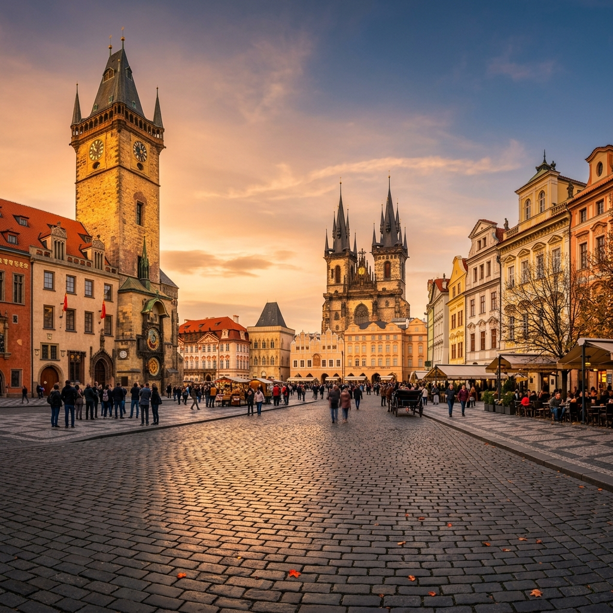
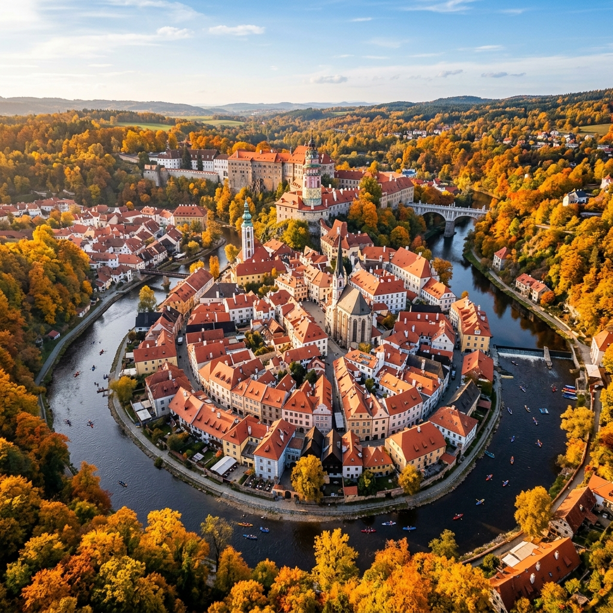
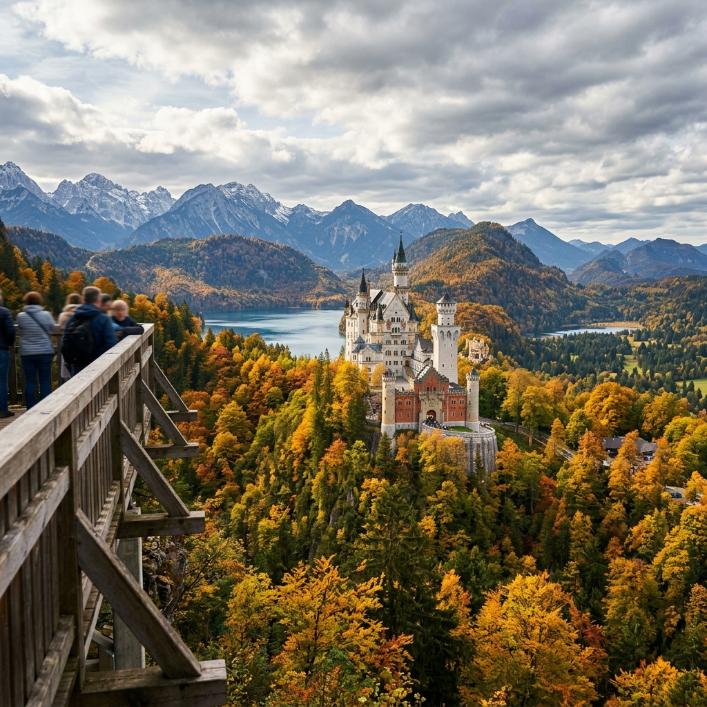
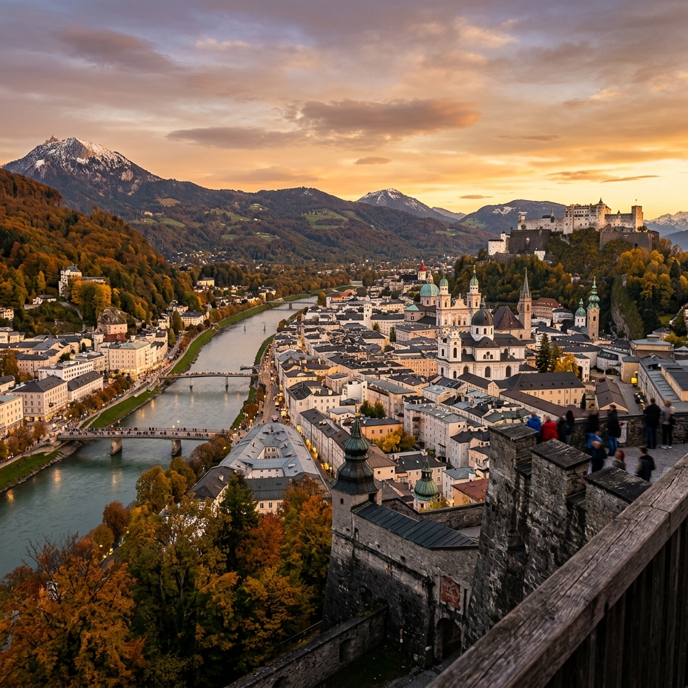
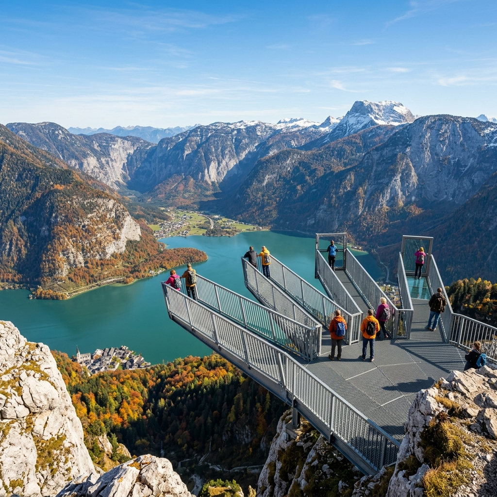
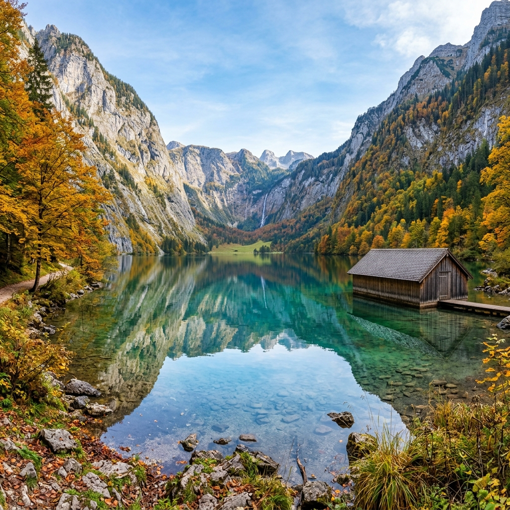
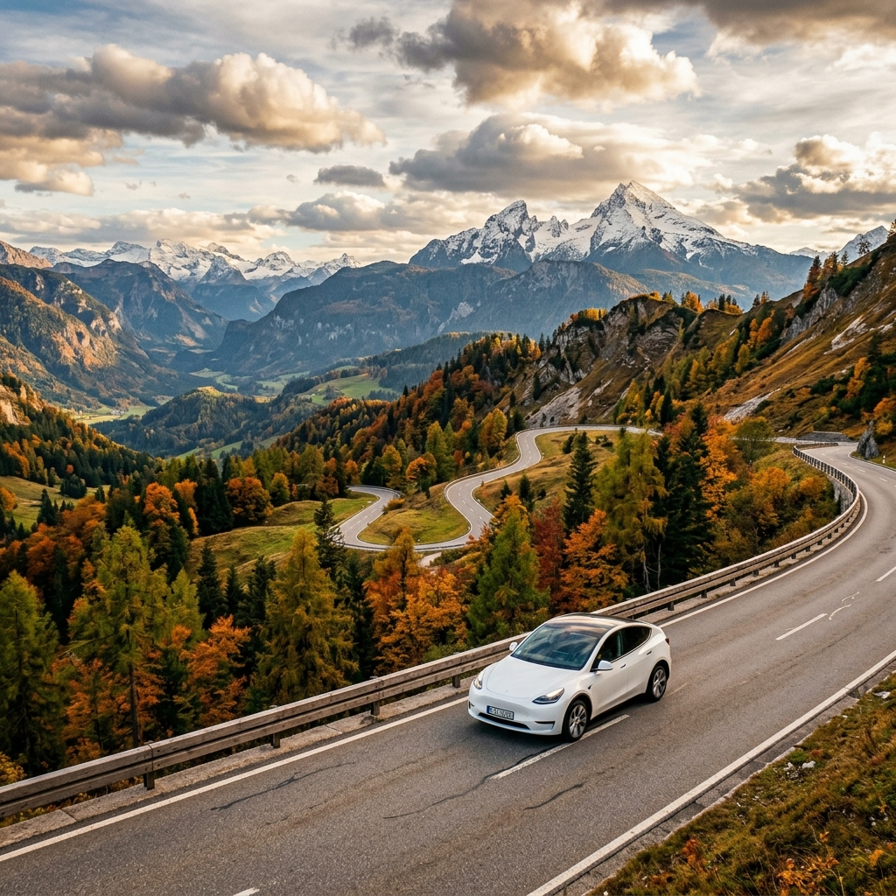
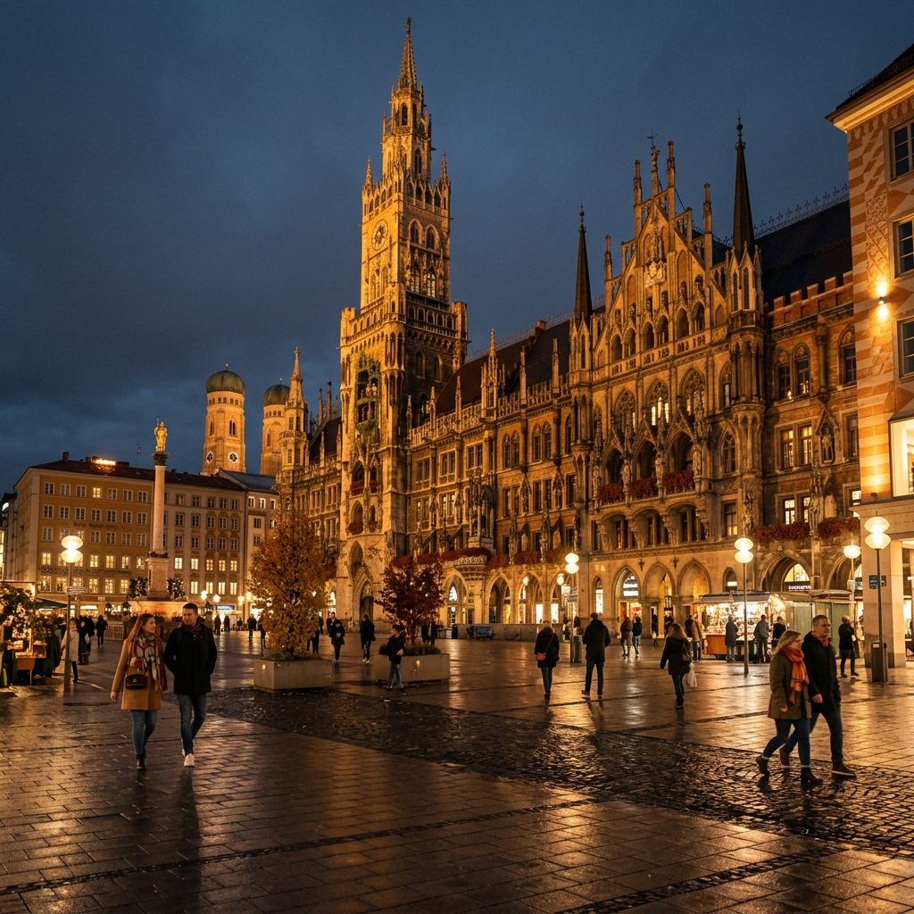

# 🗺️ 歐洲純電自駕 13 日行程 — 完整複習指南

> **路線**：台北 ✈️ 布拉格 → CK 小鎮 → 慕尼黑 → 富森 → 薩爾斯堡 → 哈爾施塔特 → 貝希特斯加登 → 慕尼黑 ✈️ 台北
> **建議出發**：2026/10/1（四）｜**回程**：2026/10/13（二）
> **國家**：🇨🇿 捷克 → 🇩🇪 德國 → 🇦🇹 奧地利 → 🇩🇪 德國

---

## 第一章：🇨🇿 捷克段（Day 1–4）

### Day 1｜抵達布拉格 — 百塔之城初見面



| 項目 | 內容 |
|------|------|
| **航班** | 星宇 JX101，00:10 台北起飛 → 08:25 抵達布拉格 |
| **活動** | 抵達後輕鬆漫步老城區，適應時差 |
| **住宿** | 布拉格市區附廚房公寓（Airbnb） |
| **交通** | 步行 + 地鐵/電車 |

> 💡 **提醒**：購買布拉格 3 日交通券（EUR 15-18），含地鐵/電車/巴士

---

### Day 2｜布拉格市區深度探索

| 項目 | 內容 |
|------|------|
| **上午** | 步行探索**查理大橋**（清晨人少，最佳拍攝時間） |
| **下午** | **布拉格城堡**（B 路線套票 EUR 14，含聖維特大教堂） |
| **傍晚** | **老城廣場**巡禮，觀賞天文鐘 |
| **住宿** | 同 Day 1 公寓 |

> 🔍 **隱藏景點**：
> - 萊特納公園 (Letná Park) — 絕佳天際線拍攝角度，觀光客少
> - 斯特拉霍夫修道院圖書館 — 全歐最美巴洛克圖書館之一（EUR 6）

---

### Day 3｜布拉格河畔與高堡區

| 項目 | 內容 |
|------|------|
| **上午** | 伏爾塔瓦河畔漫步 |
| **下午** | **高堡區 (Vysehrad)** — 遠離人潮的秘境觀景台 |
| **傍晚** | 瓦茨拉夫廣場夜景漫步 |
| **住宿** | 同 Day 1 公寓 |

> 🍺 推薦在萊特納公園的啤酒花園品嚐捷克精釀

---

### Day 4｜布拉格 → 庫倫洛夫（CK 小鎮）



| 項目 | 內容 |
|------|------|
| **交通** | 清晨搭 **RegioJet 巴士**（EUR 8-12，約 3 小時） |
| **下午** | **庫倫洛夫城堡** + **彩繪塔**（EUR 10-15） |
| **傍晚** | 等一日遊團客散去，獨享中世紀小鎮寧靜 |
| **住宿** | CK 舊城小旅店 |

> 🔍 **隱藏景點**：
> - 伏爾塔瓦河橡皮艇 — 從水面角度看城堡全貌（EUR 10-15/hr）
> - Egon Schiele Art Centrum — 表現主義畫家席勒美術館
> - Krcma v Satlavske — 中世紀地窖餐廳，傳統波西米亞烤肉

---

## 第二章：🇩🇪 德國段 I — 提車與城堡（Day 5–6）

### Day 5｜CK 小鎮 → 慕尼黑（移動與 Tesla 整備日）

| 項目 | 內容 |
|------|------|
| **交通** | **FlixBus/火車** 跨國移動（EUR 15-30，約 4-5 小時） |
| **下午** | 抵達慕尼黑中央車站，辦理 **Tesla 取車** |
| **整備** | 熟悉車載導航、連線 EnBW 充電 App |
| **住宿** | 慕尼黑中央車站周邊 |

> ⚡ **重要**：下載 **EnBW mobility+ App**，作為 Tesla Supercharger 之外的備援充電方案

---

### Day 6｜慕尼黑 → 富森（新天鵝堡與湖畔漫步）



| 項目 | 內容 |
|------|------|
| **自駕** | 慕尼黑 → 富森 |
| **上午** | ⭐ **新天鵝堡**（EUR 15，**務必提前官網預約**） |
| **下午** | **阿爾卑斯湖 (Alpsee) 環湖步道**（4.5 km，約 1-1.5 hr） |
| **住宿** | 富森山區 EV-friendly 飯店 |
| **充電** | Buchloe SC 或出發前滿充（20-30 min） |

> ⚠️ **瑪麗安橋 (Marienbrücke)**：最經典的拍攝點，但天氣不好可能封閉，出發前查 [官網](https://www.hohenschwangau.de) 狀態

---

## 第三章：🇦🇹 奧地利段（Day 7–8）

### Day 7｜富森 → 薩爾斯堡（景觀公路駕馭）



| 項目 | 內容 |
|------|------|
| **自駕** | 沿**德國阿爾卑斯大道**精華路段東行，跨入奧地利 |
| **駕駛體驗** | 山路多彎，電動車低重心 + 高扭力的絕佳路段 |
| **傍晚** | 步行登上 ⭐ **薩爾斯堡要塞**看日落（EUR 13-16） |
| **住宿** | 薩爾斯堡舊城區旅館 |
| **充電** | Inntal West SC（20-25 min） |

> 🔍 **推薦體驗**：
> - 米拉貝爾宮花園 — 《乘風而去》經典拍攝地（免費）
> - 糧食胡同 (Getreidegasse) — 莫札特出生故居所在窄巷
> - Stiegl-Brauwelt — 薩爾斯堡最大私人啤酒廠導覽 + 試飲（EUR 14）

---

### Day 8｜薩爾斯堡 → 哈爾施塔特（高山冰洞與觀景台）



| 項目 | 內容 |
|------|------|
| **自駕** | 駛入薩爾茨卡默古特湖區，沿途經沃夫岡湖、月亮湖 |
| **全日重點** | ⭐⭐ **達赫斯坦山 (Dachstein)** 高山體驗 |
| **住宿** | 上特勞恩湖畔民宿（避開哈爾施塔特的擁擠） |
| **充電** | 短程，出發前充至 80% |

#### 達赫斯坦行程安排（約 4-5 小時）

```
纜車上站 → 冰洞導覽（50 min）→ 五指觀景台（來回 1 hr）
→ 猛獁洞導覽（50 min）→ 下山
```

| 套票內容 | 價格 |
|---------|------|
| 纜車 + 冰洞 + 猛獁洞 + 五指觀景台 | EUR 40-50 |

> ❄️ **穿著提醒**：冰洞內部終年 0°C 以下，即使 10 月也需穿保暖外套 + 防滑鞋

---

## 第四章：🇩🇪 德國段 II — 國王湖深度駐紮（Day 9–11）

> 🏕️ **連續三晚**住同一基地（貝希特斯加登），免除搬行李的繁瑣，最大化山林放鬆時間

### Day 9｜哈爾施塔特 → 貝希特斯加登（魔法森林）

| 項目 | 內容 |
|------|------|
| **自駕** | 移動至貝希特斯加登 |
| **下午** | ⭐ **魔法森林 (Zauberwald)** + **辛特湖 (Hintersee)** 健行 |
| **氛圍** | 芬多精、清澈湖水、微風、寧靜 |
| **住宿** | 貝希特斯加登山區公寓（連住 3 晚） |
| **充電** | Salzburg SC 途中補電（15-20 min） |

---

### Day 10｜⭐⭐⭐ 國王湖全日深度探索（行程高光）



| 項目 | 內容 |
|------|------|
| **全日行程** | ⭐⭐⭐ **國王湖 (Königssee)** 深度徒步 |
| **船票** | 電動船至 Salet（EUR 21-25） |
| **住宿** | 同 Day 9 公寓 |

#### 建議時程表

| 時間 | 活動 |
|------|------|
| 07:30 | 出發前往碼頭 |
| 08:00 | 搭乘**第一班電動船**（避開人潮） |
| 09:00 | 抵達 St. Bartholomä → 不停留，繼續搭船 |
| 09:30 | 抵達 **Salet 碼頭** |
| 09:45 | 步行 15 min → 抵達 ⭐ **內湖 Obersee** |
| 10:00 | 繼續上行 45 min → ⭐ **羅特巴赫瀑布**（德國最高，落差 470m） |
| 12:00 | 原路返回，在 Obersee 野餐 |
| 14:00 | 搭船回 St. Bartholomä |
| 14:30 | 品嚐 ⭐ **煙燻鱒魚 (Steckerlfisch)**（國王湖經典名物） |
| 16:00 | 搭末段船返回 |
| 17:00 | 回到住宿 |

> ⚠️ **10/11 是 Obersee 最後營業日**！10/1 出發 → Day 10 = 10/10，安全趕上

---

### Day 11｜貝希特斯加登周邊（峽谷 + 全景公路）



| 項目 | 內容 |
|------|------|
| **上午** | ⭐ **溫巴赫峽谷 (Wimbachklamm)** 聽泉觀瀑（EUR 5） |
| **下午** | ⭐ **羅斯菲爾德全景公路 (Roßfeldpanoramastraße)** 自駕 |
| **住宿** | 同 Day 9 公寓 |

#### 羅斯菲爾德公路攻略

| 資訊 | 內容 |
|------|------|
| 全長 | 15.5 km |
| 最高海拔 | 1,600m（德國海拔最高景觀公路） |
| 通行費 | EUR 8.50 |
| 最佳時段 | 14:00-16:00（光線最佳，避清晨濃霧） |

> ⚡ **Tesla 提醒**：上坡耗電大但下坡可回充約 10-15%，出發前電量 60% 以上

---

## 第五章：🇩🇪 回程（Day 12–13）

### Day 12｜貝希特斯加登 → 慕尼黑（還車日）

| 項目 | 內容 |
|------|------|
| **上午** | 山區最後巡禮 |
| **下午** | 驅車返回慕尼黑中央車站 → **Tesla 還車** |
| **住宿** | 慕尼黑市區 |
| **充電** | Rosenheim SC 或 Irschenberg SC（20-30 min） |

---

### Day 13｜慕尼黑 → 返程



| 項目 | 內容 |
|------|------|
| **上午** | **瑪利亞廣場**周邊漫步 + 3C 設備/當地補給採購 |
| **下午** | 前往慕尼黑機場 |
| **航班** | 長榮 BR72，約 12:00 慕尼黑起飛 → 次日早晨抵達台北 |

---

## 📊 全程數據總覽

| 指標 | 數據 |
|------|------|
| **總天數** | 13 天 |
| **跨越國家** | 3（🇨🇿🇩🇪🇦🇹） |
| **自駕天數** | 8 天（Day 5 取車 → Day 12 還車） |
| **租車** | Tesla（含基本保險 EUR 600-900） |
| **住宿城市** | 6 個城市，12 晚 |
| **全程預估** | TWD 100,000 – 153,000 |

### 交通模式切換

```
Day 1-4：🚶 步行 + 🚌 大眾運輸（布拉格 & CK 小鎮）
Day 5：  🚌 跨國巴士 → 🚗 Tesla 取車
Day 6-12：🚗 Tesla 純電自駕（阿爾卑斯山區）
Day 13：  ✈️ 搭機返台
```

### Tesla 充電站規劃

| Day | 路線 | 充電站 | 時間 |
|-----|------|--------|------|
| 6 | 慕尼黑→富森 | Buchloe SC | 20-30 min |
| 7 | 富森→薩爾斯堡 | Inntal West SC | 20-25 min |
| 8 | 薩爾斯堡→上特勞恩 | 出發前充至 80% | — |
| 9 | 上特勞恩→貝希特斯加登 | Salzburg SC | 15-20 min |
| 10-11 | 貝希特斯加登當地 | 住宿處壁掛充電 | 隔夜慢充 |
| 12 | 貝希特斯加登→慕尼黑 | Rosenheim / Irschenberg SC | 20-30 min |

---

> 🎯 **下一步行動**：趁星宇 7/25 前促銷買 10/1 去程機票（JX101），回程長榮 BR72（10/13）可在 8 月中再訂！
