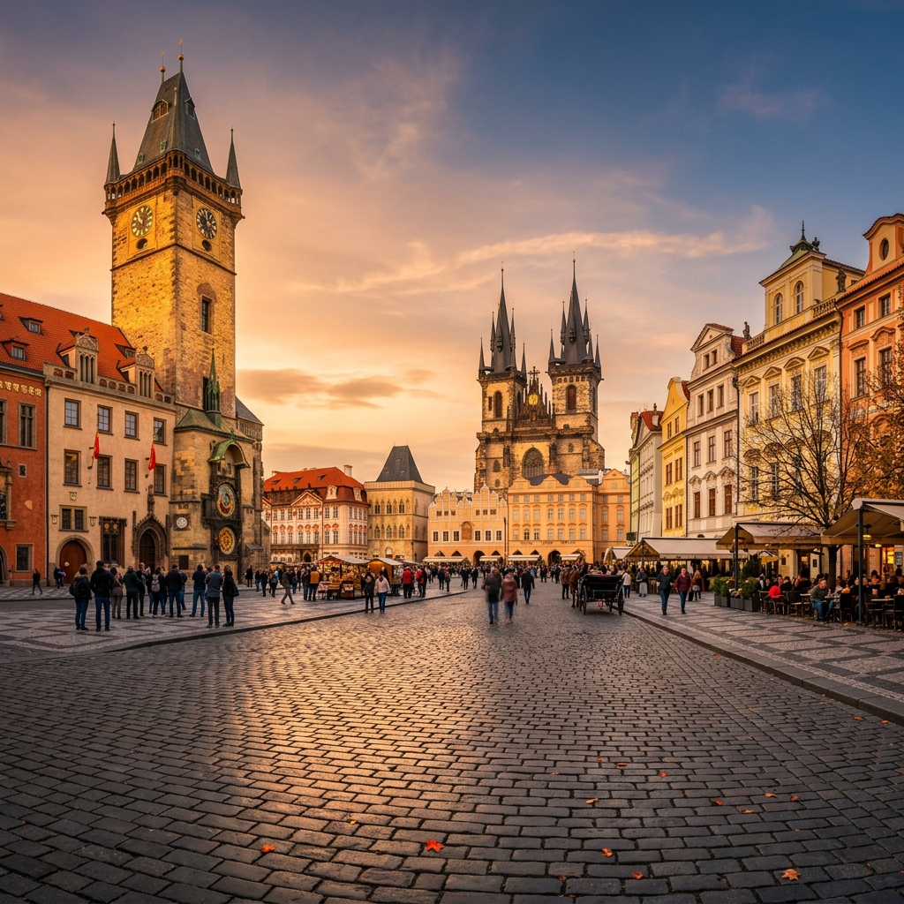
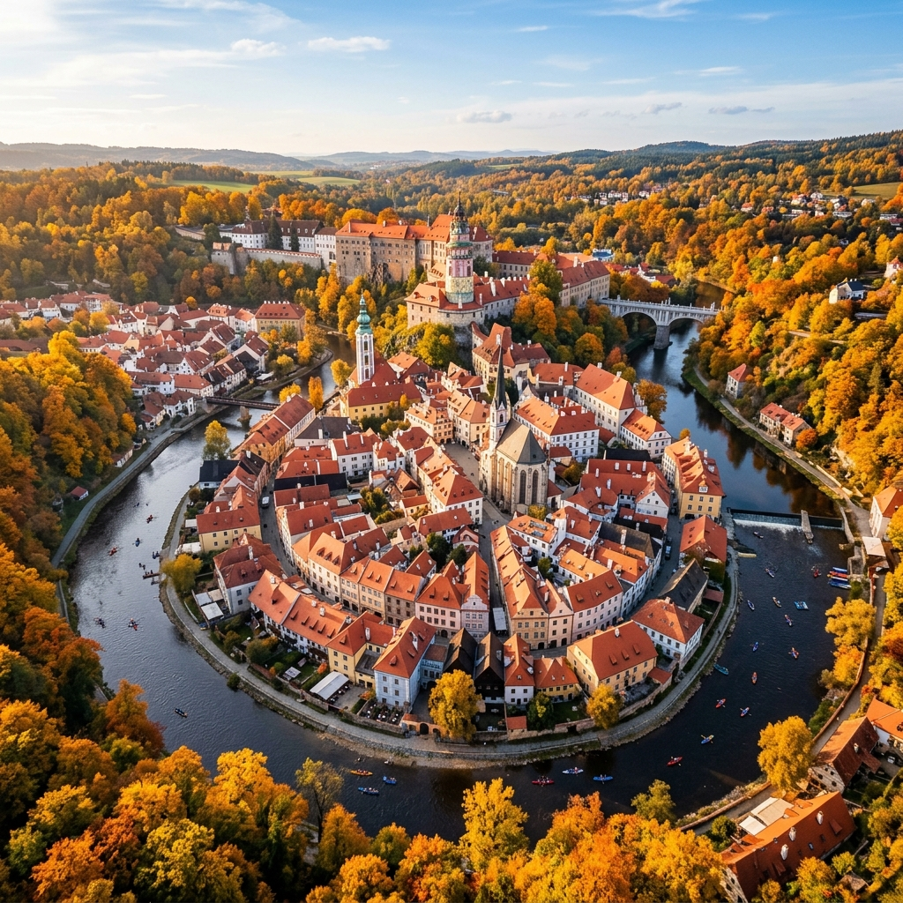
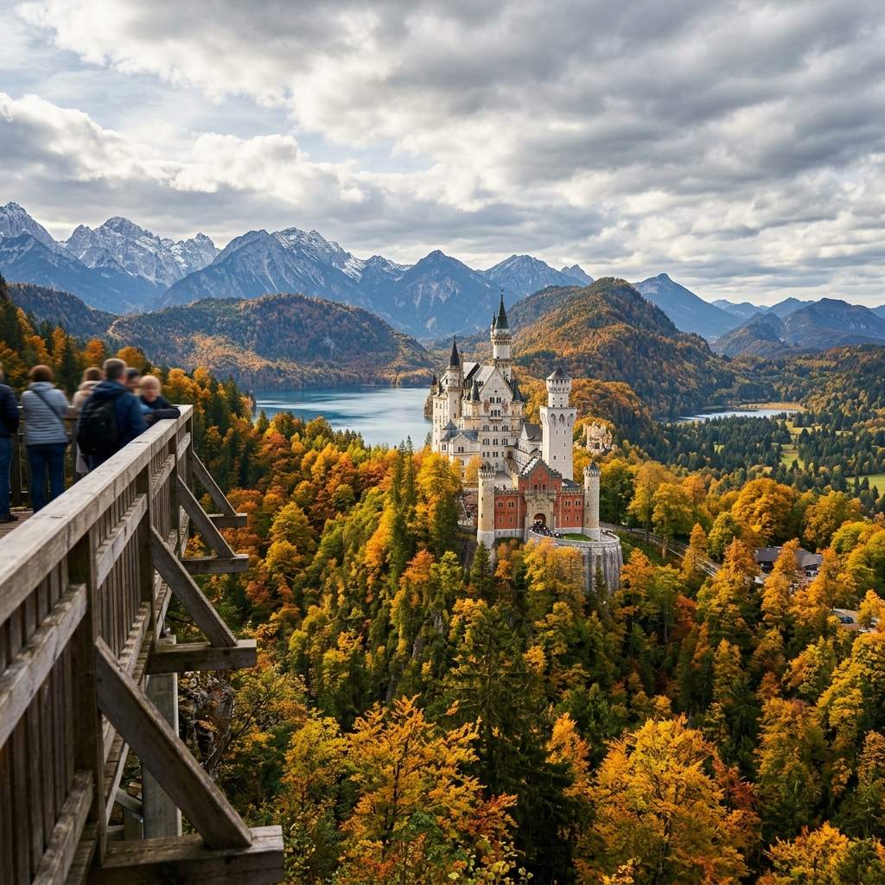
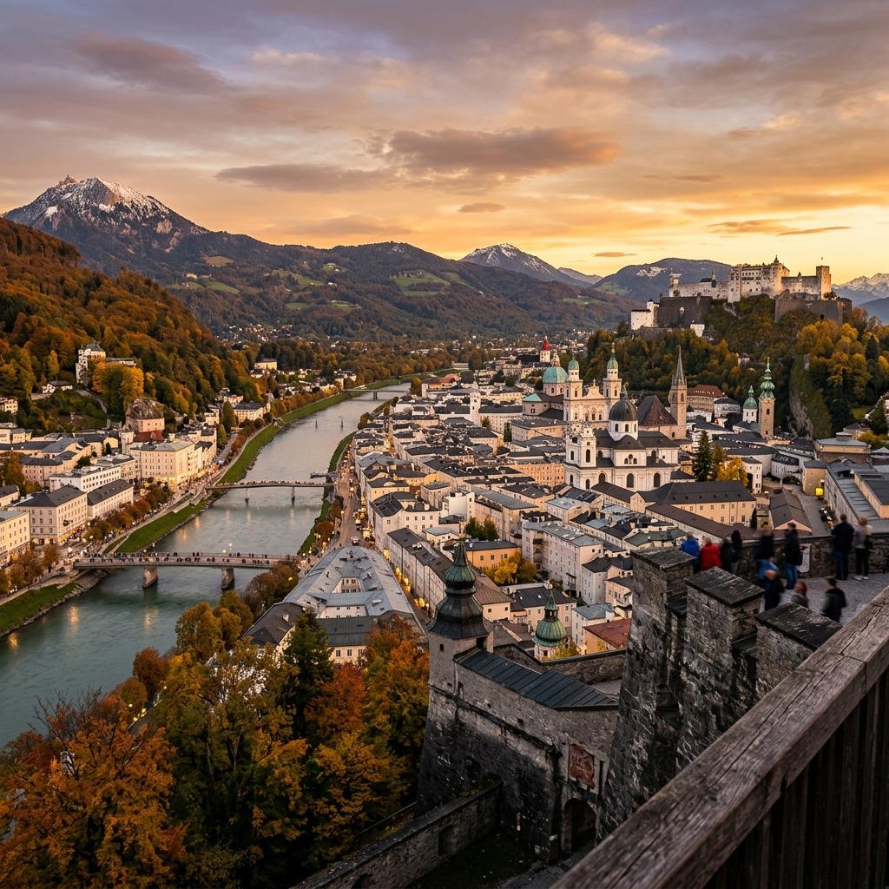
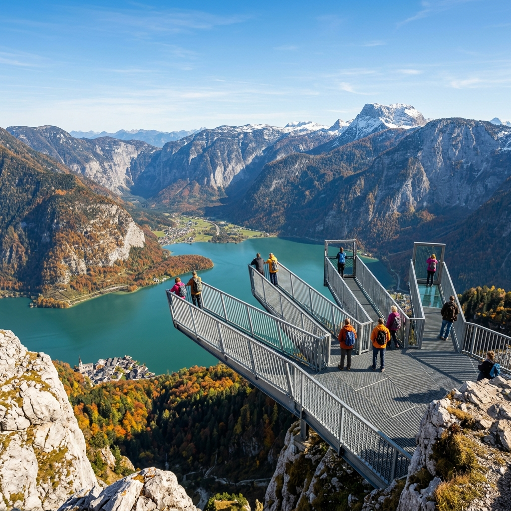
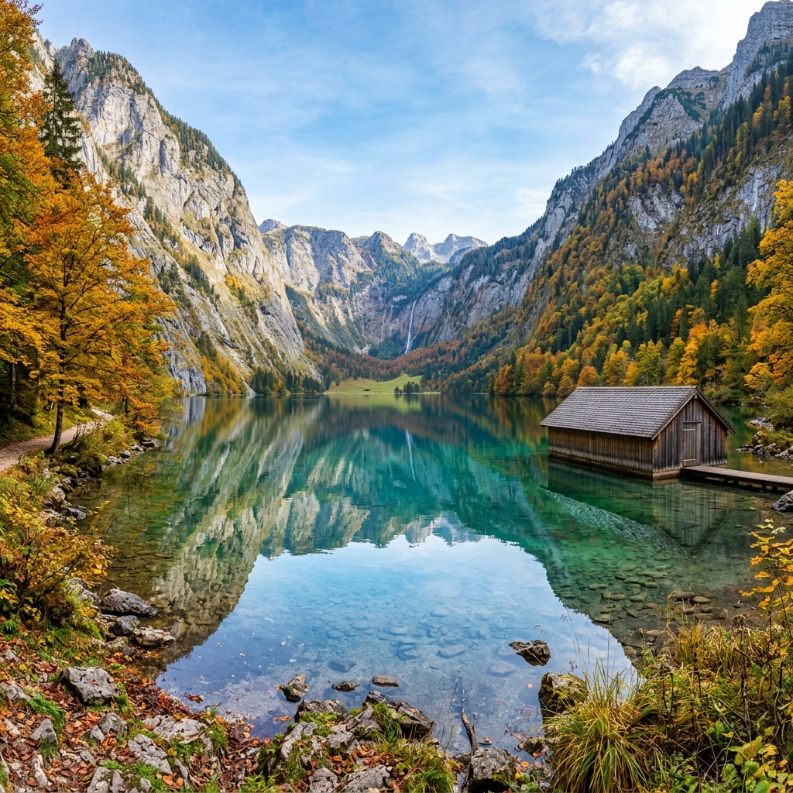
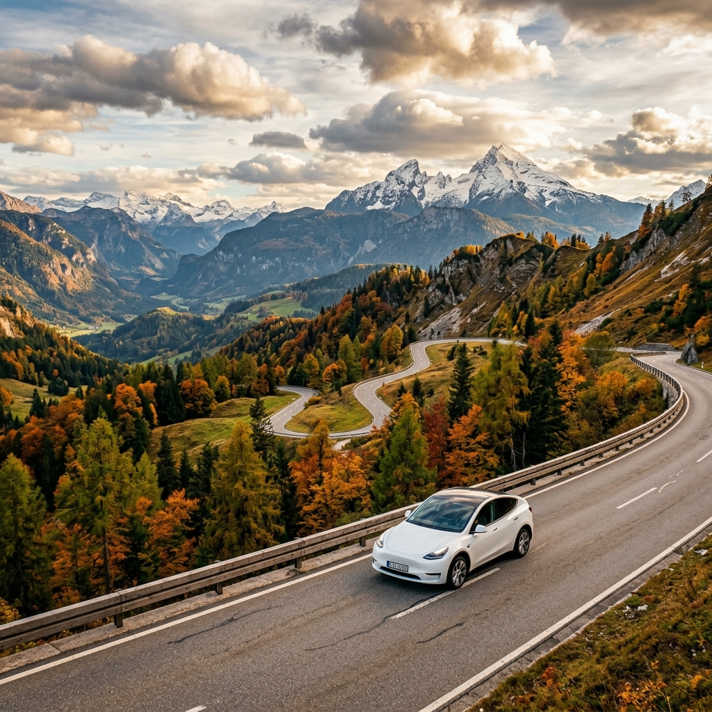
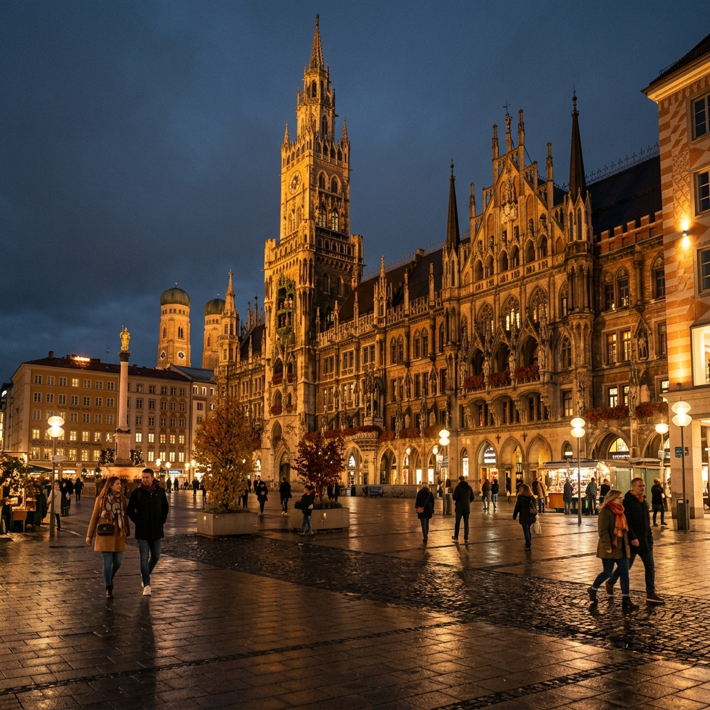

# 🗺️ 歐洲純電自駕 13 日行程 — 完整複習指南

> **路線**：台北 ✈️ 布拉格 → CK 小鎮 → 慕尼黑 → 富森 → 薩爾斯堡 → 哈爾施塔特 → 貝希特斯加登 → 慕尼黑 ✈️ 台北
> **去程航班**：2026/09/30（三）22:50 台北起飛 ✈️ 2026/10/01（四）08:25 抵達布拉格｜**回程**：2026/10/13（二）
> **國家**：🇨🇿 捷克 → 🇩🇪 德國 → 🇦🇹 奧地利 → 🇩🇪 德國

---

## 第一章：🇨🇿 捷克段（Day 1–4）

### Day 1（10/1 四）｜抵達布拉格 — 百塔之城初見面



| 時段 | 規劃重點 |
|------|---------|
| **早晨** | 星宇 JX101（9/30 22:50 台北起飛）於 08:25 抵達布拉格 (PRG)，搭車前往安德爾公寓寄存行李，洗漱稍作休息調時差 |
| **中午** | 公寓周邊或老城外圍咖啡館輕食午餐 |
| **下午** | 前往**老城廣場**漫步、觀賞**天文鐘**（整點報時秀），登天文鐘塔樓俯瞰紅瓦屋頂 |
| **晚上** | 🍽️ **推薦晚餐：Lokál Dlouhááá**（單人友善啤酒館，必點 Svíčková 白醬燉牛肉佐麵糰、新鮮坦克生啤酒） |

> 💡 **提醒**：購買布拉格 3 日交通券，搭乘地鐵/路面電車便利無阻。

---

### Day 2（10/2 五）｜晨霧大橋、城堡區與落日啤酒

| 時段 | 規劃重點 |
|------|---------|
| **早上** | 清晨 06:00 前往**查理大橋**避開人潮獨享晨霧空景，隨後小城區安靜漫步 |
| **中午** | 小城區/城堡山下傳統小館午餐（可單點 Smažený sýr 炸乳酪搭馬鈴薯） |
| **下午** | 參觀**布拉格城堡區**（聖維特大教堂震撼拱頂與彩繪玻璃、舊皇宮、黃金小巷） |
| **晚上** | 登上**萊特納公園啤酒花園 (Letná Beer Garden)**，大樹木桌下喝一杯平價生啤，俯瞰伏爾塔瓦河多座橋樑與百塔夕陽 |

---

### Day 3（10/3 六）｜高堡秘境、河畔漫步與黃昏遊船

| 時段 | 規劃重點 |
|------|---------|
| **早上** | 前往**高堡區 (Vyšehrad)** 遠離遊客喧囂，享受河岸制高點視野與聖彼得保羅聖堂 |
| **中午** | 河畔景觀餐廳或小區特色咖啡館用餐 |
| **下午** | 伏爾塔瓦河畔漫步（拍跳舞的房子、河畔天鵝視角）、斯特拉霍夫修道院圖書館 |
| **晚上** | 🚢 **伏爾塔瓦河黃昏遊船 (Vltava River Sunset Cruise)**（船上看查理大橋與城堡暮色），隨後瓦茨拉夫廣場散步 |

---

### Day 4（10/4 日）｜布拉格 → 庫倫洛夫（CK 小鎮）— 走入中世紀童話世界



| 項目 | 內容 |
|------|------|
| **交通移動** | **RegioJet 黃色大巴**（10:00 自布拉格 Na Knížecí 車站出發，座位 23，約 12:55 抵達 CK 總站 AN，已訂票 ✅） |
| **下午高光** | 舊城廣場散步 ➔ 塞米納爾花園 ➔ 登 ⭐ **彩繪塔**（162 階）俯瞰 Ω 馬蹄灣 ➔ 漫步 ⭐ **斗篷橋** 與第五中庭石窗 |
| **傍晚獨享** | 17:00 後一日遊團客全數撤離，獨享中世紀鵝卵石小巷的靜謐與金色夕陽 |
| **晚餐推薦** | 地窖柴火炭烤 或 水車磨坊烤鱒魚（單人友善份量，詳見下方指南） |
| **住宿** | **凱茲旅館 (Pension Krumlovský Mlýn)**（舊城理髮師橋畔水車磨坊，地點絕佳，已完成付款付清 🟢） |

#### 🏰 CK 小鎮 5 大經典與拍照秘境

1. ⭐ **彩繪塔登頂 (Castle Tower)**：全鎮最高點，360 度俯瞰伏爾塔瓦河將整座紅瓦小鎮緊緊包圍的經典「Ω 馬蹄形」全景。
2. ⭐ **斗篷橋 (Cloak Bridge) 與第五中庭石窗**：三層巨型石拱橋，穿過後在第五中庭牆上的石雕圓弧窗口拍照，完美框住小鎮天際線。
3. ⭐ **塞米納爾花園觀景台 (Seminární zahrada)**：聖維特教堂旁，由下往上遠眺城堡岩壁、彩繪塔與斗篷橋的最佳「平視明信片視角」（午後順光最美）。
4. 🐻 **城堡護城河看棕熊 (Bear Moat)**：走過第一與第二中庭間的石橋時，低頭探看自 16 世紀傳承至今的活生生棕熊。
5. 🌊 **伏爾塔瓦河水畔漫步**：在理髮師橋 (Lazebnický most) 與古老水壩前欣賞水流倒影與城堡峭壁。

#### 🍽️ 獨行旅客 CK 美食精選（份量剛好、不踩雷）

> ⚠️ **單人用餐提醒**：捷克傳統「烤豬腳（Koleno）」重達 1.2～1.5 kg，為 2–3 人份，一人挑戰極易油膩撐肚。

*   **選項 A：【傳奇地窖炭烤】Krčma v Šatlavské ulici**
    *   *體驗重點*：古代地牢改建，大廚在大壁爐柴火直火炭烤，氣氛極度復古！
    *   *單人推薦點法*：**炭烤肉排/烤肉串 (200-250g) ＋ 招牌麵包蒜頭湯 (Česnečka) ＋ 捷克黑生啤**（剛好一人飽足，避開巨無霸豬腳）。
    *   *貼士*：極熱門，抵達當天下午先路過訂位，或 17:00 開門即前往排隊。
*   **選項 B：【伏爾塔瓦河烤鱒魚】Krumlovský Mlýn（旅館樓下）**
    *   *體驗重點*：水車磨坊水畔露天座，整尾新鮮現烤淡水鱒魚 (Pstruh) 佐香草與馬鈴薯，肉質清甜爽口不油膩，一人一條剛剛好。
*   **選項 C：【百年地道小酒館】Hospoda Na Louži**
    *   *體驗重點*：深受當地人喜愛的懷舊木裝潢酒館，供應一人份的經典**捷克燉牛肉 (Guláš)** 配麵包糰子與 Eggenberg 生啤，平價又道地。
*   **街頭必嚐小吃**：現烤肉桂煙囪捲 (Trdelník)，外酥內軟裹著焦糖肉桂香，秋天邊散步邊吃最過癮。

#### 📅 CK 小鎮 24 小時黃金遊玩動線

```
[Day 4 10/4 日]
13:00 抵達 CK 巴士總站 ➔ 拖行李漫步 10 分鐘入城 ➔ 入住凱茲旅館放行李稍歇
   ↓
13:30 - 16:30 舊城探索 ➔ 塞米納爾花園拍照 ➔ 穿過理髮師橋登上彩繪塔 ➔ 走過斗篷橋與第五中庭
   ↓
17:00 一日遊旅行團退場！街道瞬間安靜，黃昏夕陽灑在紅瓦屋頂上，享受漫步時光
   ↓
18:00 - 19:45 晚宴享受（地窖柴燒炭烤 或 磨坊烤鱒魚）
   ↓
20:00 - 21:00 醉人夜遊：走上理髮師橋看城堡金黃色打光與河水夜景倒影 ➔ 回旅館休息

[Day 5 10/5 一]
07:30 - 09:00 ⭐ 獨行最高享受：清晨晨霧中的無人小鎮！獨享空景大片
   ↓
09:30 - 11:30 愜意早餐 ➔ 探訪 Koh-i-Noor 刺蝟色鉛筆老店、波西米亞手工藝品
   ↓
11:45 - 12:45 伏爾塔瓦河畔輕食午餐 ➔ 整理行李退房
   ↓
13:00 步行前往 CK 巴士總站 (AN)
   ↓
13:35 搭乘 FlixBus 前往慕尼黑（19:15 抵達慕尼黑 ZOB，準備隔天取車自駕！）
```

---

## 第二章：🇩🇪 德國段 I — 抵達慕尼黑、取車與新天鵝堡（Day 5–6）

### Day 5（10/5 一）｜CK 小鎮 → 慕尼黑（跨國移動與宿前整備）

| 項目 | 內容 |
|------|------|
| **交通** | **FlixBus 跨國長途巴士**（13:35 出發，19:15 抵達慕尼黑中央巴士總站 ZOB，已訂票 ✅） |
| **傍晚** | 抵達慕尼黑 ZOB，搭乘 S-Bahn 前往西側 Laim 區（車程約 5-8 分鐘） |
| **整備** | 入住飯店、享用晚餐、確認隔天早上取車證件（國際駕照 IDP + 台灣駕照正本） |
| **住宿** | **Hotel Tessin**（特辛酒店，近 Nextmove 取車點，步行僅約 5-8 分鐘，9/3 已扣款/授權 🟢） |

> 💡 **提醒**：今晚好好休息養精蓄銳，**明天（Day 6）早上 09:00 正式取車**展開純電自駕之旅！

---

### Day 6（10/6 二）｜慕尼黑取車 → 富森（新天鵝堡與湖畔漫步）



| 項目 | 內容 |
|------|------|
| **早上** | ⭐ **09:00 Nextmove 慕尼黑站點取車**（Landsberger Str. 318D，Tesla Model 3 RWD，車牌 W-AK 7176E） |
| **車機設定** | 檢查車況、熟悉單踏板駕駛、登入 Tesla App、設定導航與 EnBW mobility+ App |
| **自駕路段** | 慕尼黑 ➔ 富森（經 A96 高速公路轉 B17，車程約 120 km，約 1.5 小時） |
| **下午停靠** | 🅿️ **13:30 前停妥 Parkplatz P4（阿爾卑斯湖畔停車場）**（離瑪麗恩橋接駁公車站最近，€12/6hr） |
| **核心景點** | ⭐ **13:45 搭接駁公車至瑪麗恩橋 (Marienbrücke)** 拍新天鵝堡全景 ➔ 散步至城堡大門 |
| **預約導覽** | ⭐⭐ **14:55 新天鵝堡內部參觀**（英文語音導覽，門票已預訂確認 ✅） |
| **傍晚順遊** | 步行下山至湖畔，漫步 **阿爾卑斯湖 (Alpsee) 環湖步道**（水質清澈倒映群山） |
| **住宿** | **富森中央城旅館 (Central City Hotel Füssen)**（附設地下/周邊充電樁，近富森老城步行街） |
| **充電** | 抵達富森飯店後接上充電樁慢充，隔天滿電出發！ |

> ⚠️ **瑪麗恩橋 (Marienbrücke)**：最經典明信片拍攝點，若天候不佳可能暫時管制，現場依指示通行。

---

## 第三章：🇦🇹 奧地利段（Day 7–8）

### Day 7（10/7 三）｜富森 → 阿爾卑斯大道精華 → 薩爾斯堡（壯麗自駕巡禮）



| 項目 | 內容 |
|------|------|
| **自駕路線** | 沿德國最美景觀公路**「德國阿爾卑斯大道 (Deutsche Alpenstraße)」**東行，跨入奧地利（全長約 210 km） |
| **自駕特色** | 山岳多彎、高山草甸與翡翠碧湖，Tesla 低重心與強勁動能回充在此路段發揮極致 |
| **住宿** | **H+ Hotel Salzburg**（已付清 🟢，直通中央車站地下停車場，免開車進老城徒步區） |
| **充電** | 途經 Tesla Supercharger Bernau am Chiemsee 快充補電 15-20 min（或飯店地下停車場慢充） |

#### Day 7 沿途自駕停靠點規劃

```
[09:00] 富森中央城旅館滿電出發 ➔ 沿 B17 往東北開行約 25 km
   ↓
[09:40 - 10:20] ⭐ 停靠點 1：世界文化遺產【維斯朝聖教堂 (Wieskirche)】
   • 停泊專屬 Parkplatz Wieskirche（前 2 小時 €2.00）
   • 洛可可建築巔峰奇蹟，高山草原與群山環繞中的金色天頂壁畫，停留約 30-40 分鐘
   ↓ 🚗 沿阿爾卑斯大道東行約 45 km（經科赫爾山路翻過 Kesselberg 隘口）
[11:00 - 11:30] ⭐ 停靠點 2：高山碧湖【瓦爾興湖・赫爾佐格纜車湖畔大停車場 (Parkplatz Herzogstandbahn)】
   • 停泊全湖腹地最廣的官方大停車場（車位極多、平價好停）
   • 漫步大片綠茵湖濱公園 (Seepromenade)，以最開闊壯麗的全景視野眺望「巴伐利亞馬爾地夫」純淨翡翠綠水面與對岸 Jochberg 群山，停留約 20-30 分鐘
   ↓ 🚗 沿景觀公路與 A8 往東開行約 80 km
[12:15 - 13:45] ⭐ 停靠點 3：巴伐利亞海【基姆湖普林碼頭 (Prien Hafen Stock S1 停車場)】
   • 停妥普林港口 S1 超大停車場（單日約 €6.50）
   • 港口湖畔漫步、欣賞百年蒸汽火車與大渡輪，享用午餐（推薦品嚐基姆湖現烤白鮭魚）
   ↓ 🚗 可選中繼補電（距港口約 5 km）：【Tesla Supercharger Bernau am Chiemsee】
[14:00 - 14:20] ⚡ 超充站快速補電 15-20 分鐘（8 樁 250kW V3，上廁所喝飲料）
   ↓ 🚗 沿 A8 越過德奧邊境直奔薩爾斯堡約 45 km（需備好奧地利高速公路通行證 Vignette）
[14:45 - 15:00] 🅿️ 抵達薩爾斯堡：停妥【H+ Hotel 地下停車場 (Tiefgarage Hauptbahnhof)】
   • 電梯直達大廳辦理 Check-in，放妥行李完全免開車進老城徒步區！
   ↓ 🚶 步行或搭無軌電車前往老城
[15:30 - 19:30] ⭐ 薩爾斯堡老城探索與夕陽要塞：
   • 漫步米拉貝爾花園 (Mirabellgarten) 拍照
   • 穿過薩爾察赫河漫步糧食胡同 (Getreidegasse)，尋找莫札特出生故居
   • 傍晚搭登山纜車登上 ⭐⭐【薩爾斯堡要塞 (Festung Hohensalzburg)】俯瞰巴洛克百塔落日與老城夜景
```

---

### Day 8（10/8 四）｜薩爾斯堡 → 巴德伊舍 ➔ 達赫斯坦山 (高山冰洞與五指觀景台) ➔ 上特勞恩



| 項目 | 內容 |
|------|------|
| **自駕路線** | 薩爾斯堡 ➔ 經 B158 駛入薩爾茨卡默古特世界遺產湖區 ➔ 巴德伊舍 ➔ 上特勞恩（車程約 75 km） |
| **上午停靠** | ⭐ **巴德伊舍 (Bad Ischl)** — 奧匈帝國皇家避暑溫泉小鎮，百年名店 Café Zauner 咖啡甜點 |
| **全日高光** | ⭐⭐⭐ **達赫斯坦山 (Dachstein Krippenstein)** — 巨型冰洞導覽 + 懸崖五指觀景台 |
| **住宿** | 上特勞恩湖畔 **Dormio Resort Obertraun**（已付清 🟢，附設充電樁，避開觀光團） |
| **充電** | 抵達渡假村後插上慢充，隔夜充至 100% |

#### 達赫斯坦行程安排（配合 13:00 下午票）

```
[09:30] 薩爾斯堡出發 ➔ 經 B158 風景線開往巴德伊舍（約 50 km，50 分鐘）
   ↓
[10:30 - 11:45] ⭐ 停靠點 1：皇家溫泉小鎮【巴德伊舍 (Bad Ischl)】
   • 停放在市中心停車場 (Parkplatz Zentrum/Kurhaus)
   • 漫步特勞恩河畔，造訪百年皇家御用甜點店【Café Zauner】享用維也納米朗琪咖啡佐經典榛果雪茄蛋糕
   ↓ 🚗 沿特勞恩湖南行至達赫斯坦纜車站（約 25 km，25 分鐘）
[12:30 - 12:45] 🅿️ 抵達【達赫斯坦纜車停車場 (Seilbahn Talstation)】停妥車輛（€5.00）
   • 先在山下輕裝享用輕便午餐，帶好保暖羽絨衣、手套、毛帽
   ↓
[13:00] 刷票搭第 1 段纜車至 Schönbergalm (1,350m) ➔ 步道健行 15 分鐘至洞口穿上厚外套
   ↓
[13:45 - 14:35] ⭐ 參觀【達赫斯坦巨型冰洞 (Giant Ice Cave)】（50 分鐘專業導覽，內部終年 0°C）
   ↓
[14:45] 搭第 2 段纜車直衝 2,100m 山頂站 (Krippenstein)
   ↓
[15:15 - 16:15] ⭐⭐ 漫步至【五指觀景台 (5 Fingers)】俯瞰 400 公尺懸崖深淵與哈爾施塔特湖全景
   ↓
[16:45] 搭乘纜車下山回到停車場
   ↓ 🚗 開車 8 分鐘抵達湖畔渡假村
[17:15] 入住【Dormio Resort Obertraun】，插上慢充充電樁，享受靜謐湖畔之夜
```

> ❄️ **穿著提醒**：冰洞內部終年 0°C 以下，山頂海拔 2,100m 風大，建議洋蔥式穿法，進冰洞前再套上保暖防風外套與毛帽。

---

## 第四章：🇩🇪 德國段 II — 國王湖深度駐紮（Day 9–11）

> 🏕️ **連續三晚**住同一基地（貝希特斯加登），免除搬行李的繁瑣，最大化山林放鬆時間

### Day 9（10/9 五）｜哈爾施塔特 → 跨國自駕 ➔ 辛特湖 (Hintersee) ➔ 魔法森林 (Zauberwald) ➔ 拉姆紹教堂 ➔ 貝希特斯加登

| 項目 | 內容 |
|------|------|
| **上午** | 哈修塔特經典明信片視角晨遊漫步（清晨寧靜無遊客喧囂） |
| **自駕動線** | 上特勞恩出發 ➔ 經 B158/B305 跨越邊境直奔拉姆紹西端 **辛特湖 (Hintersee)**（車程約 1 hr 15 min） |
| **下午核心** | 停妥 **Parkplatz Seeklause (P1)** ➔ ⭐ **魔法森林 (Zauberwald)** 芬多精健行 + 辛特湖環湖步道 |
| **傍晚順遊** | 回程沿溪流經拉姆紹小鎮 ➔ ⭐ **拉姆紹教堂 (Pfarrkirche St. Sebastian)** 溪流小木橋明信片留影（15 min） |
| **住宿** | **Explorer Hotel Berchtesgaden**（連住 3 晚大本營，附設電動車充電樁） |

#### Day 9 時程與動線示意

```
[08:30 - 11:30] 哈修塔特晨間漫步 / 湖畔早午餐
      ↓ 🚗 越過邊境與貝希特斯加登市區，一路直奔西側終點
[13:30 - 16:30] 停泊 Parkplatz Seeklause (P1) ➔ 辛特湖環湖 + 魔法森林巨石溪流芬多精健行
      ↓ 🚗 沿山谷公路 Hinterseer Str. 返程往東開 4.5 公里（約 6-7 分鐘）
[16:45 - 17:15] 拉姆紹小鎮中心 ➔ 拉姆紹教堂與小木橋拍照（夕陽順光金黃時分）
      ↓ 🚗 沿 B305 往東開 10 公里（約 12 分鐘）
[17:30] 抵達 Explorer Hotel Berchtesgaden 辦理入住、接上充電樁，享受三連霸大本營！
```

---

### Day 10（10/10 六）｜⭐⭐⭐ 國王湖全日深度探索（行程最高光）



| 項目 | 內容 |
|------|------|
| **全日行程** | ⭐⭐⭐ **國王湖 (Königssee)** 深度徒步 |
| **停車規劃** | 🅿️ 08:00 前停妥 **Großparkplatz Königssee** 大停車場（€9.00/天） |
| **船票航程** | 08:30 步行至碼頭，搭乘早班電動船至最深處 **Salet 碼頭** |
| **住宿** | Explorer Hotel Berchtesgaden（連住第 2 晚） |

#### 建議時程表

| 時間 | 活動與停靠亮點 |
|------|----------------|
| 07:45 | 從 Explorer Hotel 出發（車程僅 4 分鐘） |
| 08:00 | 停妥 **Großparkplatz Königssee**，步行經商店街前往碼頭 |
| 08:30 | 登上開往 Salet 的早班電動船（坐右側看回音壁小號演奏與紅蔥頭教堂水上倒影） |
| 09:55 | 抵達終點 **Salet 碼頭**，進入原始國家公園保護區 |
| 10:15 | 抵達 ⭐ **上湖木造船屋 (Bootshaus am Obersee)**，欣賞震撼倒影天空之鏡 |
| 11:15 | 抵達對岸世外桃源 ⭐ **Fischunkelalm 木屋**，喝現擠冰牛奶配黑麥麵包 |
| 12:00 | 深入後方阿爾卑斯峭壁谷底，仰望德國最高垂直巨瀑 ⭐ **羅特巴赫瀑布 (Röthbachfall)** |
| 13:45 | 步回 Salet 碼頭搭船前往聖巴多羅買半島 |
| 14:30 | 抵達 **聖巴多羅買教堂 (St. Bartholomä)**，參觀古老修道院並品嚐名物 ⭐ **煙燻鱒魚 (Steckerlfisch)** |
| 16:30 | 搭末段遊船返回國王湖起點碼頭，回飯店休息 |

> ⚠️ **重要時間點**：10 月中旬為 Obersee 內湖遊船最後營運期，10/10 前往正是秋色最燦爛的安全時機！

---

### Day 11（10/11 日）｜貝希特斯加登東北環線（阿姆巴赫峽谷 + 羅斯菲爾德全景公路）



| 項目 | 內容 |
|------|------|
| **上午** | ⭐ **阿姆巴赫峽谷 (Almbachklamm)** 聽泉觀瀑 + 百年大理石彈珠水車磨坊（EUR 6） |
| **中午** | 峽谷入口 Gasthof Kugelmühle 露天座輕食 / 烘焙坊咖啡小憩（週日正常營業） |
| **下午** | ⭐ **羅斯菲爾德全景公路 (Roßfeldpanoramastraße)** 自駕（經北收費站直上 1,570m 稜線） |
| **住宿** | Explorer Hotel Berchtesgaden（連住第 3 晚） |

#### 羅斯菲爾德公路攻略

| 資訊 | 內容 |
|------|------|
| 全長 | 15.4 km |
| 最高海拔 | 1,570m（德國海拔最高景觀公路） |
| 通行費 | EUR 9.00（小客車全車包價，含所有觀景停車） |
| 最佳時段 | 13:30-16:00（光線最佳，避清晨濃霧，午後順光照亮薩爾斯堡平原） |

> ⚡ **Tesla 提醒**：北收費站上山爬升耗電，南收費站下坡單踏板動能回充約 10-15%，出發前電量 60% 以上即可輕鬆暢行。

---

## 第五章：🇩🇪 回程（Day 12–13）

### Day 12（10/12 一）｜貝希特斯加登 → 慕尼黑（精釀咖啡、超充補電與還車日）

| 項目 | 內容 |
|------|------|
| **上午** | 悠閒退房，享受阿爾卑斯山區清新空氣，沿 B305 轉 A8 高速公路北返慕尼黑 |
| **途中停靠** | ☕ **中繼高光：Dinzler Kaffeerösterei am Irschenberg**（A8 交流道旁著名精品咖啡烘焙坊） |
| **補電站** | ⚡ **Tesla Supercharger Irschenberg**（在 Dinzler 喝手沖吃甜點時充電 15-20 min） |
| **下午還車** | ⭐ **16:00 前抵達 Nextmove 慕尼黑站點（Landsberger Str. 318D）辦理還車手續** |
| **住宿** | **Premier Inn München City West**（已付清 🟢，還車後步行 3 分鐘即可抵達入住） |

> 💡 **還車小提醒**：還車前將車內個人物品帶齊，電量依照 Nextmove 規定回充至約定標準即可。

---

### Day 13（10/13 二）｜慕尼黑 → 機場返程



| 項目 | 內容 |
|------|------|
| **上午** | 步行或搭 S-Bahn 至**瑪利亞廣場 (Marienplatz)** 周邊散步、欣賞新市政廳、採買巴伐利亞紀念品與伴手禮 |
| **中午** | 搭乘 S-Bahn（S1 或 S8 線，約 40-45 分鐘）直達慕尼黑機場 (MUC) |
| **返程航班** | **國泰航空**（10/13 MUC ➔ HKG ➔ TPE，經香港轉機返回台北，已開票 ✅） |

---

## 📊 全程數據總覽

| 指標 | 數據 | 備註 |
|------|------|------|
| **總天數** | 13 天 | 2026/10/01 – 2026/10/13 |
| **跨越國家** | 3 國（🇨🇿 捷克 ➔ 🇩🇪 德國 ➔ 🇦🇹 奧地利 ➔ 🇩🇪 德國） | 申根區無邊境檢查關卡 |
| **純電自駕天數** | **7 天**（Day 6 早上 09:00 取車 ➔ Day 12 下午 16:00 還車） | 慕尼黑 Nextmove 站點取還 |
| **自駕車型** | **Tesla Model 3 RWD**（Nextmove 合約 VNN-26-106734-2，車牌 W-AK 7176E） | 含零自負額全險、玻璃輪胎險、跨境奧地利許可 |
| **自駕里程預估** | 約 850 – 950 km | 包含在 1,000 km 免費額度內 |
| **住宿安排** | 12 晚全數確認（布拉格3晚、CK1晚、慕尼黑1晚、富森1晚、薩爾斯堡1晚、上特勞恩1晚、貝希特斯加登3晚、慕尼黑1晚） | 過半已全額付清 |
| **旅遊保險** | 海外全程旅平險 ＋ 旅遊不便險 | 2026-09-16 完成線上投保 ✅ |

### 交通模式切換一覽

```
Day 1-4：  🚶 步行 + 🚌 大眾運輸 / 跨城巴士（布拉格市區 & CK 小鎮）
Day 5：    🚌 FlixBus 跨國長途巴士（CK ➔ 慕尼黑 ZOB），轉 S-Bahn 進飯店休息
Day 6-12： 🚗 Tesla Model 3 純電自駕（阿爾卑斯大道、薩爾斯堡、世界遺產湖區、國王湖山區）
Day 13：   ✈️ 國泰航空經香港返台
```

### Tesla 充電站完整規劃

| Day | 路線與停靠 | 推薦充電方式 | 備註 |
|-----|------------|--------------|------|
| 6 | 慕尼黑取車 ➔ 新天鵝堡 ➔ 富森 | 富森中央城旅館隔夜慢充 | 交車 80%+，抵達富森後插上慢充 |
| 7 | 富森 ➔ 阿爾卑斯大道 ➔ 薩爾斯堡 | Supercharger Bernau am Chiemsee | 中途基姆湖快充 15-20 min（或飯店地下停車場） |
| 8 | 薩爾斯堡 ➔ 巴德伊舍 ➔ 達赫斯坦山 ➔ 上特勞恩 | Dormio Resort Obertraun 隔夜慢充 | 渡假村附設充電樁，隔夜充至 100% |
| 9 | 上特勞恩 ➔ 辛特湖 ➔ 貝希特斯加登 | Explorer Hotel Berchtesgaden 隔夜慢充 | 連續駐紮第 1 晚慢充 |
| 10 | 國王湖全日徒步 ➔ 貝希特斯加登 | Explorer Hotel Berchtesgaden 隔夜慢充 | 連續駐紮第 2 晚慢充 |
| 11 | 阿姆巴赫峽谷 ➔ 羅斯菲爾德全景公路 | Explorer Hotel Berchtesgaden 隔夜慢充 | 連續駐紮第 3 晚慢充 |
| 12 | 貝希特斯加登 ➔ 慕尼黑還車 | Supercharger Irschenberg (Dinzler 咖啡旁) | 喝咖啡時快充補電 15-20 min |

